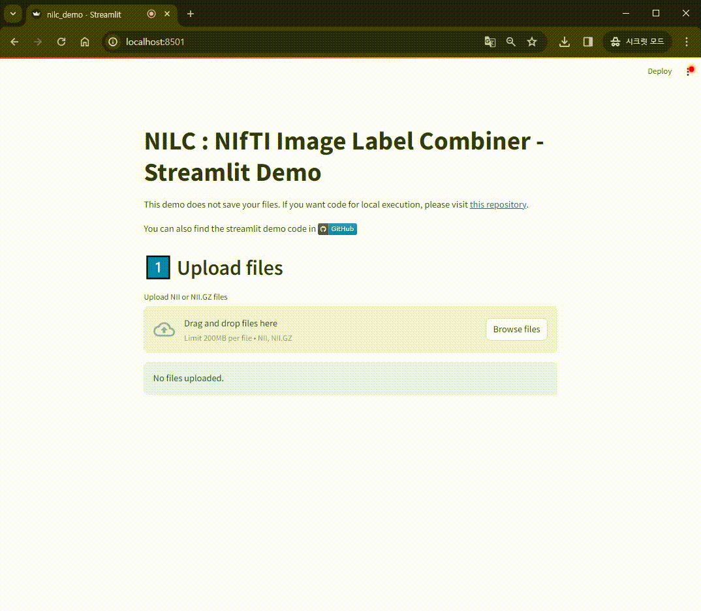

# NILC: NIfTI Image Label Combiner
Combine multiple label maps into a single one.

# Python Code
TBD

# Streamlit Live Demo
You can try out this app on the [Streamlit Community Cloud](https://nilc-demo.streamlit.app/).

Additionally, you can find the code in [this branch](https://github.com/oikosohn/nifti-label-combiner/tree/streamlit).

